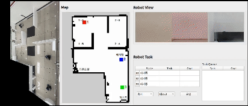
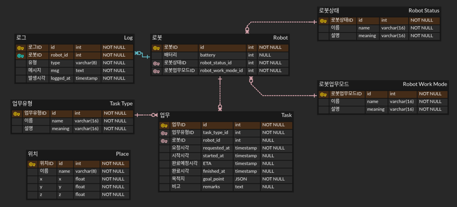
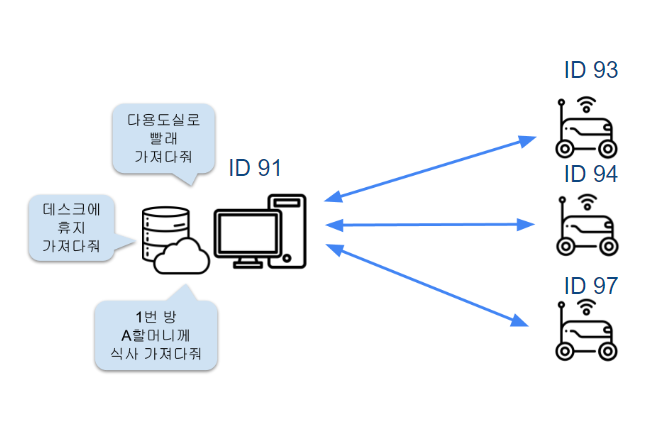
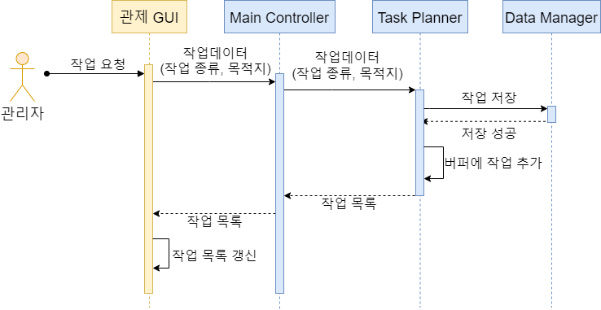
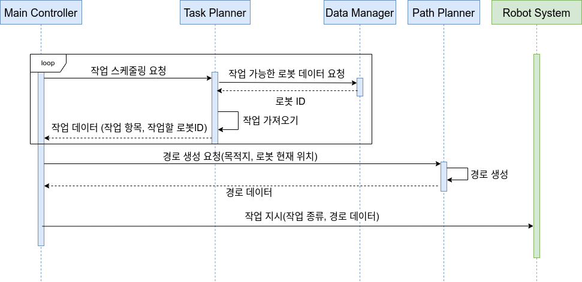
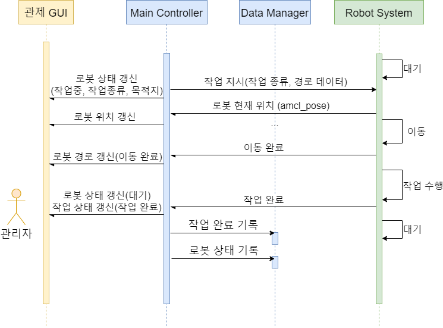
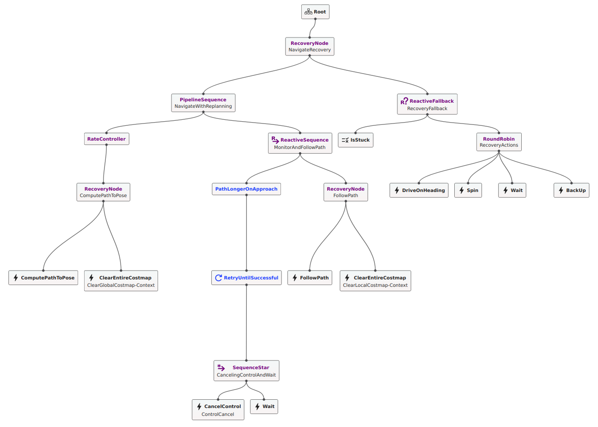

# Multi Driving Robot Control System
<p align=center width="98%">
  
</p>
<p><a href="https://youtu.be/rqWVjeEV688?feature=shared">Watch the full video here</a></p>

This was a team project with 6 members.<br>
For a full project description, please refer to the README of the forked repository.

---

## Role in the Project
- Designing scenarios for task planning
- Setting up ROS Domain Bridge for multi-robot control
- Writing communication interfaces between the control system, robot system, and GUI
- Modifying the behavior tree (in XML using nav2)

### Tech Stack
|   |   |
|---|---|
|Development Environment|    ||
|Technology|   |
|Communication|  |

### Project Duration
December 26, 2023 - January 25, 2024

---

## Design

### Data Structure
<p align=center width="98%">
  
</p>

### Multi-Robot Control
<p align=center width="98%">
  
</p>

### Task Planning
#### Task Request Scenario
<p align=center width="98%">
  
</p>

#### Task Scheduling Scenario
<p align=center width="98%">
  
</p>

#### Task Execution Scenario
<p align=center width="98%">
  
</p>

### Navigation
#### Behavior Tree
<p align=center width="98%">
  
</p>

---

## How to Run

### Prerequisites
- ROS2 Humble version was installed and used.
= PinkWink's Minibot hardware and source code (https://github.com/PinkWink/pinklab_minibot_robot) were utilized. The udev was set in the minibot_bringup/scripts file.
- For motor control, PinkWink's Arduino code (https://github.com/PinkWink/pinklab_minibot_robot_firmware) was used.
- A custom YD LiDAR driver (https://github.com/byeongkyu/ydlidar_ros2_driver) was employed for LiDAR usage.
- Raspberry Pi and PC with Ubuntu 22.04 installed were used to operate the minibot.
- All PCs/Raspberry Pis were connected to the same network for ROS2 communication.
- After cloning the project, please build in the nursing_home directory.
```
git clone https://github.com/addinedu-ros-3rd/ros-repo-1.git
cd ros-repo-1/nursing_home
colcon build
source ./install/local_setup.bash
```
- The actual map must match the map file shape.
  - It's recommended to configure the map manually and replace the files under /nursing_home/src/main_pkg/map and /nursing/home/src/robot_pkg/map.
  - In this project, the map file was created as follows:
  ```
  # RPi
  ros2 launch minibot_bringup bringup_robot.launch.py

  # RPi
  ros2 launch minibot_navigation2 map_building.launch.py

  # PC
  rviz2 -d `ros2 pkg prefix minibot_navigation2`/share/minibot_navigation2/rviz/map_building.rviz

  # RPi
  ros2 run teleop_twist_keyboard teleop_twist_keyboard --ros-args -r cmd_vel:=base_controller/cmd_vel_unstamped

  # Save Map
  # RPi
  ros2 run nav2_map_server map_saver_cli -f ~/<pinkbot_ws>/<map_name>
  ```

### Multi Robot Run
#### 1) DB config<br>
- Create ```config.ini``` in nursing_home/src/main_pkg/utils
```
[dev]
host = DB Host
port = DB port
user = DB user
password = DB password
database = DB database name
```

- source mysqldump
```
source create_and_init.sql
```

#### 2)  Setting ROS_DOMAIN_ID and ROS2 Environment<br>
If you use bridge_config.yaml as is, it's recommended to add the following lines to ~/.bashrc, and then ```source ~/.bashrc```.<br>

- Monitoring PC
```
export ROS_DOMAIN_ID = 91
source /opt/ros/humble/setup.bash
source ~/nursing_home/install/local_setup.bash
```

- Robot1 RPi
```
export ROS_DOMAIN_ID = 93
source /opt/ros/humble/setup.bash
source ~/pinkbot/install/local_setup.bash
```

- Robot1 PC
```
export ROS_DOMAIN_ID = 93
source /opt/ros/humble/setup.bash
source ~/pinkbot/install/local_setup.bash
source ~/nursing_home/install/local_setup.bash
```

- Robot2 RPi
```
export ROS_DOMAIN_ID = 94
source /opt/ros/humble/setup.bash
source ~/pinkbot/install/local_setup.bash
```

- Robot2 PC
```
export ROS_DOMAIN_ID = 94
source /opt/ros/humble/setup.bash
source ~/pinkbot/install/local_setup.bash
source ~/nursing_home/install/local_setup.bash
```

- Robot3 RPi
```
export ROS_DOMAIN_ID = 97
source /opt/ros/humble/setup.bash
source ~/pinkbot/install/local_setup.bash
```

- Robot3 PC
```
export ROS_DOMAIN_ID = 97
source /opt/ros/humble/setup.bash
source ~/pinkbot/install/local_setup.bash
source ~/nursing_home/install/local_setup.bash
```

#### 3) RPi: each robot run & camera start
- terminal 1
```
ros2 launch minibot_bringup bringup_robot.launch.py
```

- terminal 2
```
sudo chmod 777 /dev/video0
ros2 run v4l2_camera v4l2_camera_node
```

#### 4) Robot PC: navigation start (yaml file dir: nursing_home/src/main_pkg/map)
- terminal 1
```
ros2 launch minibot_navigation2 bringup_launch.py map:=home.yaml
```

- terminal 2
```
ros2 run robot_pkg robot_controller
```

#### 5) Monitoring PC: GUI/Main Controller run
- terminal 1
```
ros2 run main_pkg main_controller
```

- terminal 2
```
ros2 run ui_pkg monitoring
```

- terminal 3 (ROS Domain Bridge reference: https://github.com/ros2/domain_bridge)
```
sudo apt install ros-humble-domain-bridge
ros2 run domain_bridge domain_bridge bridge_config.yaml
```
